# RTX 5090 vs RTX 4080 SUPER

Same-system GPU comparison on **Intel Core Ultra 9 285K**, 32 GB DDR5-6400.

| Workload | 4080S run | 5090 run |
|----------|-----------|----------|
| WoW (CapFrameX) | 2026-05-17 | 2026-05-30 |
| LLM (llama.cpp / llmb) | 20260517T113755 | 20260530T203552 |

## Headline

| Metric | Result |
|--------|--------|
| WoW median avg FPS (normal) | ~+1% (5090) |
| WoW median 1% low (normal) | ~−10% (5090 worse) |
| WoW max++ median avg FPS | ~+94% (5090) |
| LLM median GPU tok/s | ~+72% (5090) |

**WoW:** At normal settings the two GPUs are essentially tied on average FPS. The 5090 pulls ahead dramatically only under **max++** (all quality sliders maxed), where the 4080S looks VRAM- or fill-rate-limited. On 1% / 0.1% low FPS at normal settings, the 4080S is often slightly better despite similar averages.

**LLM:** The 5090 is ~1.7× faster on warm GPU inference across all six Q4_K_M models; larger models gain more (Qwen3-8B ~2×).

> CapFrameX reports **DX12** for all 5090 WoW captures but **DX11** for every 4080S capture — even when comments say "dx12". Treat WoW as same-route/same-settings, not guaranteed same API.

## Methodology

**WoW:** CapFrameX captures during repeatable flight paths (RE↔SoL) and raid pulls. FPS computed from per-frame `MsBetweenPresents`. Matched pairs by capture comment. Metrics: average FPS, 1% / 0.1% / 0.01% low FPS, 99th percentile.

**LLM:** `llmb bench` with six models × three workloads (summarize / code / assistant), GPU full offload. Metric: **warm tokens/s** after model load.

Raw numbers: [`comparison_data.json`](comparison_data.json)

### WoW scenario labels

Each flight-path capture is named **`{resolution} {quality} · {route}`**. These are **in-game graphics settings**, not benchmark metrics.

| Label | Meaning |
|-------|---------|
| **low** | Low **render resolution** (sub-native render scale) |
| **native** | **Native 5K** render resolution (panel/native res) |
| **min** | Minimum **GPU quality** preset — most quality sliders at minimum |
| **max** | Maximum **GPU quality** preset — high settings, but not every slider maxed |
| **max++** | **All quality sliders maxed** — heaviest GPU load in this test matrix |
| **max (−dist)** / **min (−dist)** | Same as max/min, but **drawing distance** left at default (not forced to min/max) |
| **RE→SoL** / **SoL→RE** | Flight path direction (Revendreth ↔ Shadowlands zone) |

**Not the same as chart metrics:** “1% low FPS”, “0.1% low FPS”, etc. refer to **low-percentile frametime** statistics — nothing to do with the `low` resolution setting.

---

## WoW — normal settings

### Average FPS

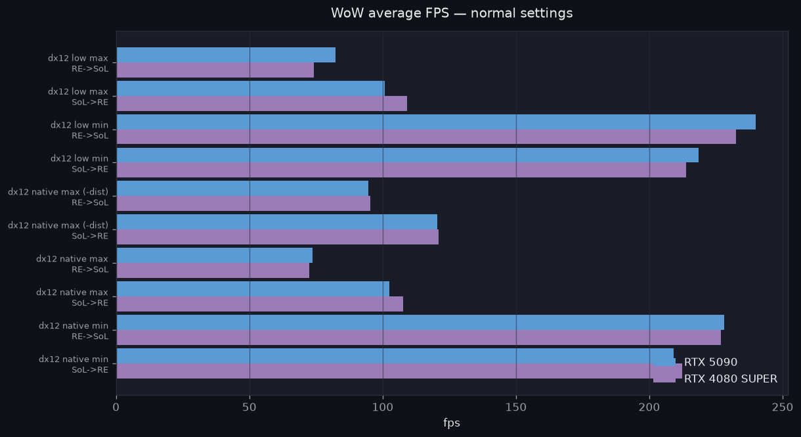

### 1% low FPS

Bottom 1% of frames by FPS — worst sustained dips, not single spikes.

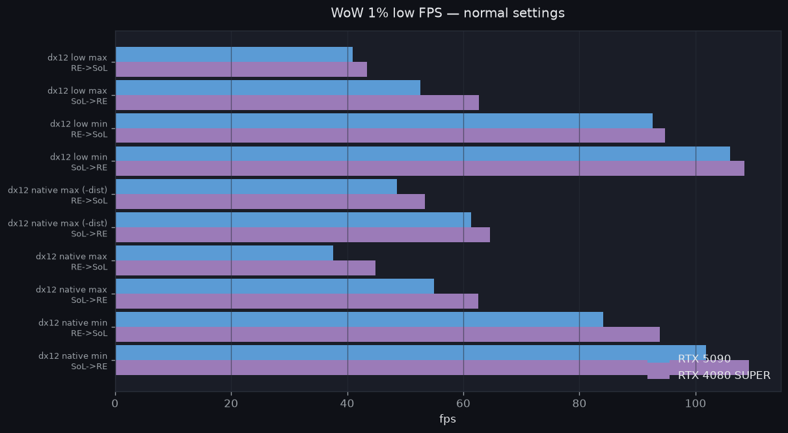

### 0.1% low FPS

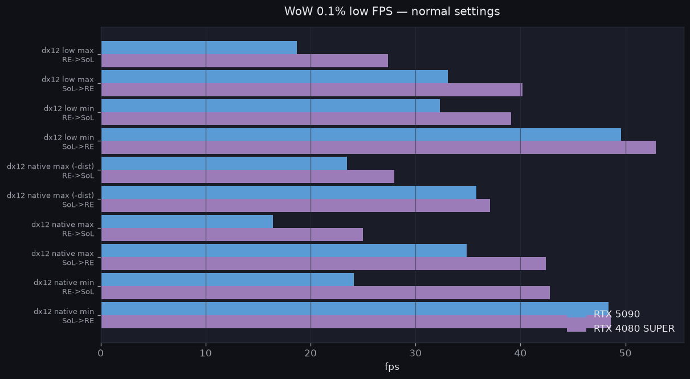

### 0.01% low FPS

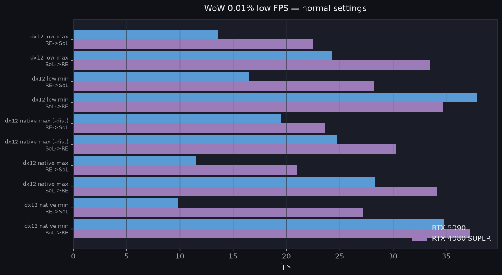

### 99th percentile FPS

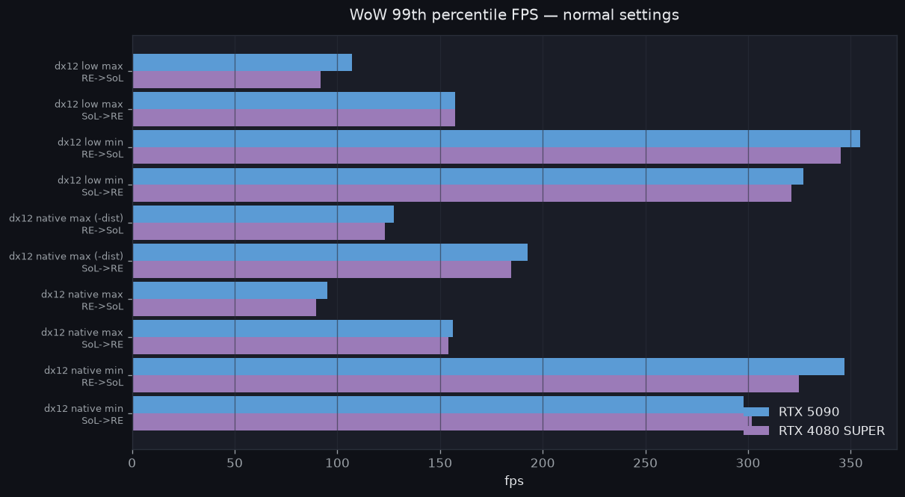

### 5090 gain % (average FPS)

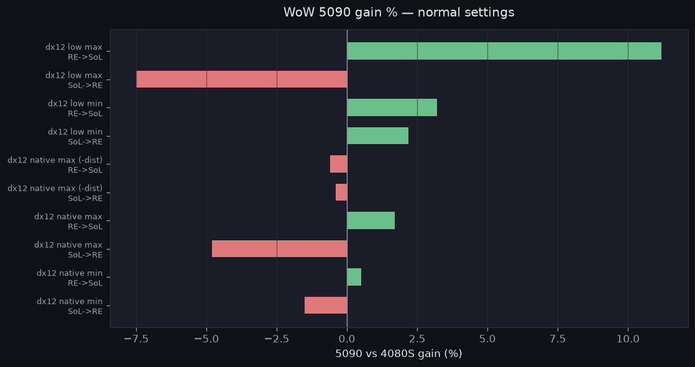

<details>
<summary>WoW normal settings — numeric table</summary>

| Scenario | Route | 5090 avg | 4080S avg | Gain | 5090 1% low | 4080S 1% low |
|----------|-------|---------:|----------:|-----:|------------:|-------------:|
| dx12 low max | RE→SoL | 82.4 | 74.1 | +11% | 40.9 | 43.4 |
| dx12 low max | SoL→RE | 100.9 | 109.1 | −8% | 52.6 | 62.7 |
| dx12 low min | RE→SoL | 239.9 | 232.5 | +3% | 92.6 | 94.8 |
| dx12 low min | SoL→RE | 218.6 | 213.8 | +2% | 106.0 | 108.4 |
| dx12 native max (−dist) | RE→SoL | 94.7 | 95.3 | −1% | 48.6 | 53.4 |
| dx12 native max (−dist) | SoL→RE | 120.5 | 121.0 | −0% | 61.4 | 64.6 |
| dx12 native max | RE→SoL | 73.6 | 72.4 | +2% | 37.6 | 44.9 |
| dx12 native max | SoL→RE | 102.4 | 107.6 | −5% | 55.0 | 62.6 |
| dx12 native min | RE→SoL | 228.0 | 226.9 | +1% | 84.1 | 93.9 |
| dx12 native min | SoL→RE | 209.2 | 212.4 | −2% | 101.8 | 109.2 |

</details>

---

## WoW — max++ (all sliders maxed)

### Average FPS

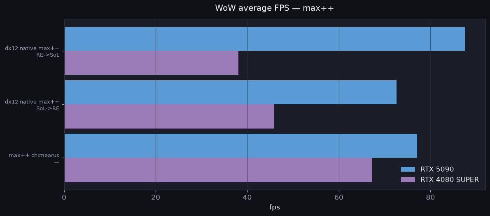

RE→SoL max++: 5090 **87.6** vs 4080S **38.1** fps (+130%). SoL→RE: **72.6** vs **45.9** (+58%). Chimaerus raid max++: **77.1** vs **67.2** (+15%).

### 1% low FPS

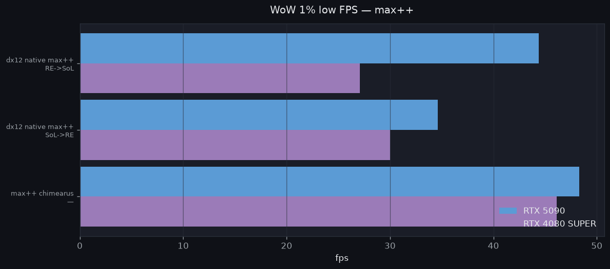

### 5090 gain %

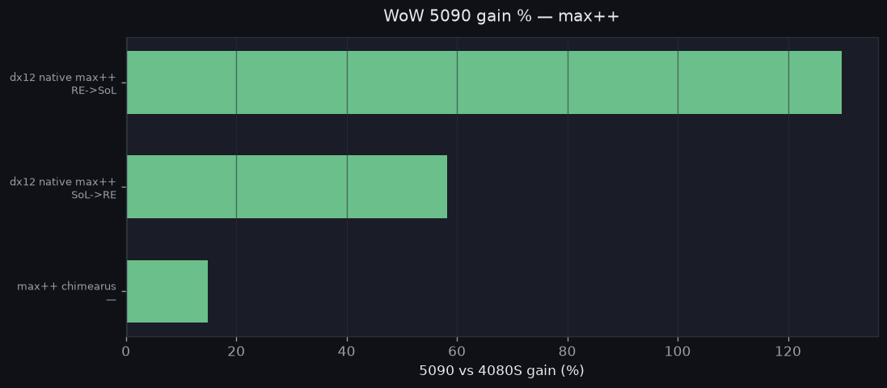

---

## LLM — warm GPU tok/s (Q4_K_M)

### By model

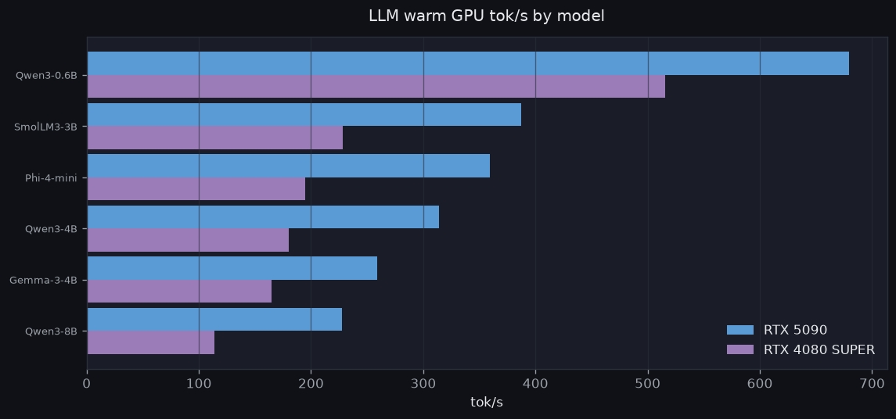

### Gain % by model

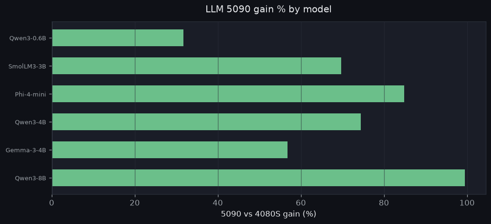

### Per model × workload

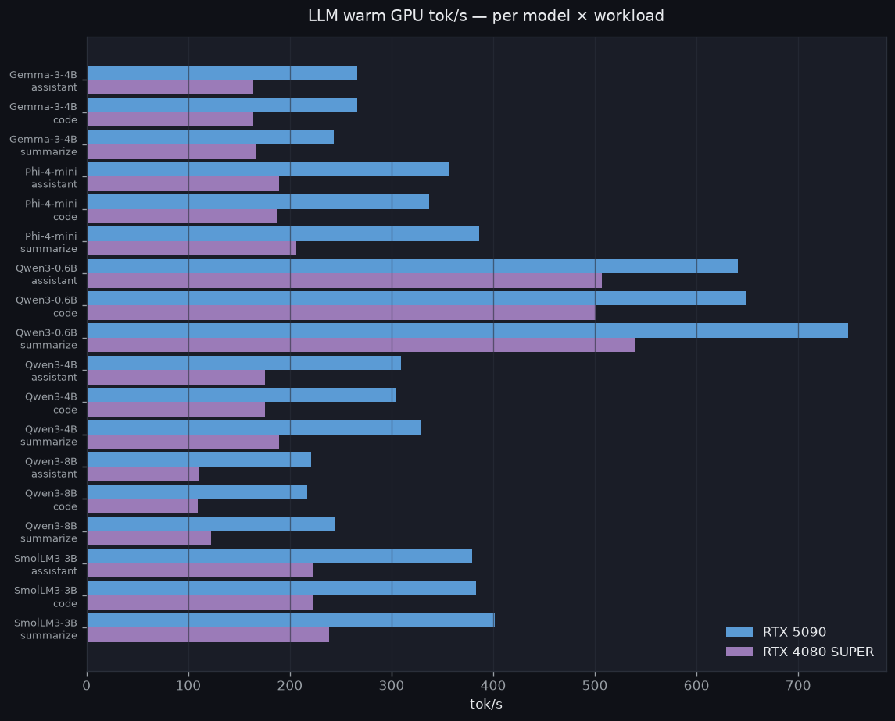

<details>
<summary>LLM — numeric table (warm GPU tok/s)</summary>

| Model | Workload | 5090 | 4080S | Gain |
|-------|----------|-----:|------:|-----:|
| Qwen3-0.6B | summarize | 749.0 | 540.0 | +39% |
| Qwen3-0.6B | code | 648.5 | 500.5 | +30% |
| Qwen3-0.6B | assistant | 640.9 | 506.6 | +27% |
| SmolLM3-3B | summarize | 401.2 | 238.8 | +68% |
| SmolLM3-3B | code | 382.8 | 223.1 | +72% |
| SmolLM3-3B | assistant | 378.9 | 223.2 | +70% |
| Qwen3-4B | summarize | 329.3 | 189.0 | +74% |
| Qwen3-4B | code | 303.8 | 175.2 | +73% |
| Qwen3-4B | assistant | 309.0 | 175.9 | +76% |
| Gemma-3-4B | summarize | 243.4 | 167.0 | +46% |
| Gemma-3-4B | code | 266.5 | 163.7 | +63% |
| Gemma-3-4B | assistant | 266.0 | 164.0 | +62% |
| Phi-4-mini | summarize | 386.3 | 206.0 | +88% |
| Phi-4-mini | code | 336.9 | 188.1 | +79% |
| Phi-4-mini | assistant | 355.9 | 189.6 | +88% |
| Qwen3-8B | summarize | 245.1 | 122.4 | +100% |
| Qwen3-8B | code | 216.8 | 109.7 | +98% |
| Qwen3-8B | assistant | 220.7 | 110.0 | +101% |

</details>

---

## Regenerate

```bash
python analyze.py        # CapFrameX + llmb → comparison_data.json
python render_charts.py  # comparison_data.json → charts/*.png
python push_to_labs.py   # push README + charts to github.com/folkol/labs
```

Local data paths (benchmark machine):

- CapFrameX: `%USERPROFILE%\Documents\CapFrameX\Captures\`
- LLM: `llm-inference-benchmark/reports/windows-x86_64__CPU-Intel_Core_Ultra_9_285K__GPU-NVIDIA_GeForce_RTX_*`
