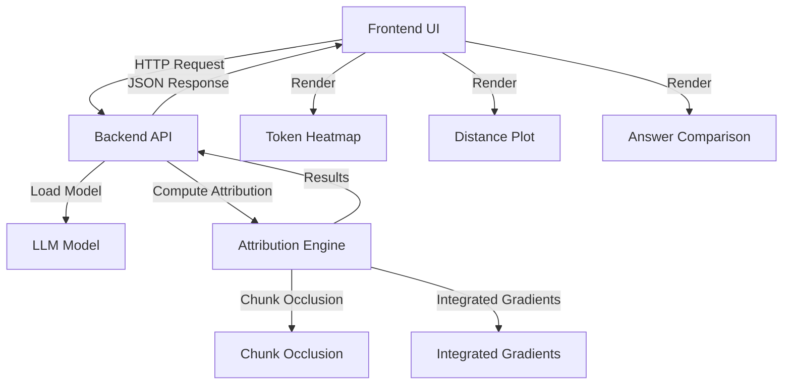

# Attention Visualization Tool - Implementation Plan

## Overview

Build a web application that visualizes token importance in LLM inference, showing which input tokens were most influential and which were ignored. The tool will demonstrate how AI agents can "forget" rules as context grows larger.

## Architecture



## File Structure

```
visualize-attention-webapp/
├── backend/
│   ├── app.py                 # FastAPI server
│   ├── attribution.py          # Attribution methods (chunk-occlusion, IG)
│   ├── model_loader.py         # Model loading and inference
│   ├── chunking.py             # Text chunking utilities
│   └── requirements.txt        # Python dependencies
├── frontend/
│   ├── index.html              # Main UI
│   ├── app.js                  # Frontend logic
│   ├── styles.css              # Styling
│   └── visualization.js        # Visualization components
├── README.md                   # Project documentation
└── .gitignore
```

## Implementation Details

### Backend (`backend/app.py`)

- FastAPI server with endpoints:
  - `POST /analyze` - Main analysis endpoint
    - Input: `{prompt: str, model_name: str, method: "chunk_occlusion" | "integrated_gradients"}`
    - Output: `{baseline_answer: str, token_importances: List[TokenImportance], attribution_data: dict}`
  - `GET /models` - List available models
  - `GET /health` - Health check

### Attribution Engine (`backend/attribution.py`)

**Chunk Occlusion Method:**

1. Split input into chunks (paragraphs → sentences → tokens)
2. Run baseline inference, record answer and logprobs
3. For each chunk:

   - Remove chunk from prompt
   - Re-run inference
   - Compute importance = baseline_score - occluded_score

4. Use two-stage refinement: coarse chunks first, then refine top chunks

**Integrated Gradients Method:**

1. Load model with gradient access (transformers library)
2. Compute gradients w.r.t. input embeddings for target output tokens
3. Integrate gradients along path from baseline to input
4. Aggregate per-token importance scores

### Model Loader (`backend/model_loader.py`)

- Support for HuggingFace transformers models
- Caching mechanism for model instances
- Inference with logprob extraction
- Configurable temperature (0 for deterministic)

### Frontend (`frontend/index.html` + `frontend/app.js`)

**UI Components:**

1. **Input Panel:**

   - Text area for prompt input
   - Model selector dropdown
   - Attribution method toggle
   - Analyze button

2. **Visualization Panel:**

   - **Token Heatmap:** Color-coded overlay on prompt text showing importance
   - **Distance Plot:** Scatter/line plot of token position vs importance
   - **Answer View:** Side-by-side comparison of baseline vs occluded answers
   - **Chunk List:** Sortable list of chunks with importance bars

3. **Interactive Features:**

   - Click token/chunk → show detailed attribution info
   - Hover → highlight related tokens
   - Toggle between visualization modes

### Visualization (`frontend/visualization.js`)

- Heatmap rendering with color intensity based on importance
- Plot generation using Chart.js or similar
- Token-level highlighting and interaction handlers

## Technical Stack

- **Backend:** Python 3.9+, FastAPI, transformers, torch
- **Frontend:** Vanilla JavaScript (or React if preferred), Chart.js for plots
- **Model:** HuggingFace transformers (e.g., Llama 2/3, Mistral, or smaller models for testing)

## Implementation Steps

1. **Setup project structure** - Create directories and basic files
2. **Backend foundation** - FastAPI server, model loader, basic inference
3. **Chunk occlusion implementation** - Core attribution method
4. **Frontend UI** - Basic input/output interface
5. **Heatmap visualization** - Token-level importance overlay
6. **Distance plot** - Position vs importance visualization
7. **Integrated Gradients** - White-box attribution method
8. **Polish and testing** - Error handling, loading states, example prompts

## Key Design Decisions

- Start with chunk-occlusion as it's more universally applicable and demonstrates the core concept
- Use two-stage chunking (coarse → fine) to balance speed and precision
- Support both methods but make chunk-occlusion the default
- Cache model instances and baseline results to avoid redundant computation
- Use deletion-based occlusion (simplest, most reliable per discussion)

## Dependencies

**Backend:**

- fastapi, uvicorn
- transformers, torch
- numpy, scipy (for IG integration)

**Frontend:**

- Chart.js (or D3.js for more control)
- No framework required for MVP (vanilla JS)

## Future Enhancements (v2+)

- Activation patching / causal tracing
- Per-layer attribution visualization
- Attention vs attribution comparison
- Batch processing for multiple prompts
- Export results as JSON/CSV