# Chunk-Occlusion Attention Visualizer (Jupyter Notebook)

## Approach

Use the **chunk-occlusion with logprob deltas** method from the ChatGPT discussion:

1. Send full prompt to OpenAI, record answer + logprobs
2. For each chunk of the input, remove it and re-run
3. `importance(chunk) = baseline_logprob - occluded_logprob`
4. Visualize which chunks mattered and which were ignored

## Location

Build in `/Users/folkol/code/labs/visualize-attention/` (where the README and discussion already live). Create a single notebook `visualize_attention.ipynb` plus a small `pyproject.toml` for dependencies.

## Notebook Structure

### Cell 1 -- Setup

- Dependencies: `openai`, `matplotlib`, `numpy`, `IPython` (display)
- API key from environment variable `OPENAI_API_KEY`
- Helper: call OpenAI Chat Completions with `logprobs=True`, `top_logprobs=5`, `temperature=0`

### Cell 2 -- Define the experiment

- A configurable **system prompt** with rules/instructions
- A **long context block** (e.g. a multi-paragraph document or a list of rules)
- A **question** that requires using specific parts of the context
- Include a pre-built example that demonstrates the "forgotten rules" scenario: a system prompt with 10+ rules, padded with filler context, and a question that tests a rule buried in the middle

### Cell 3 -- Chunking

- Split the context into chunks (paragraph-level by default, with a configurable `chunk_mode`: `paragraph`, `sentence`, or `sliding_window`)
- Display the chunks numbered for reference

### Cell 4 -- Baseline run

- Run the full prompt, collect:
  - Generated answer text
  - Per-token logprobs for the answer
  - Compute `baseline_score = sum of answer token logprobs`

### Cell 5 -- Occlusion loop

- For each chunk `c_i`, build prompt with `c_i` removed
- Run the model, collect logprobs for the **same answer tokens** (force via logit_bias or by scoring answer token logprobs)
- Compute `importance_i = baseline_score - occluded_score_i`
- Store results in a list of dicts for easy analysis
- Show a progress indicator

### Cell 6 -- Visualization: Chunk importance bar chart

- Horizontal bar chart: chunk index/preview on y-axis, importance score on x-axis
- Color-coded: green (high importance), gray (near-zero), red (negative = distracting)

### Cell 7 -- Visualization: Heatmap overlay on the prompt text

- Render the full prompt as HTML in the notebook using `IPython.display.HTML`
- Each chunk colored by importance (white-to-red gradient)
- Hoverable tooltips showing the importance score

### Cell 8 -- Visualization: Position vs Importance scatter plot

- x-axis: chunk position in the prompt (token offset)
- y-axis: importance score
- This directly shows the "context fades with distance" or "middle gets lost" pattern

### Cell 9 -- Counterfactual panel

- For the top-3 most important chunks and top-3 least important:
  - Show the baseline answer vs the occluded answer side by side
  - Highlight differences

## Dependencies

Managed via `pyproject.toml` using `uv`:

- `openai` (API client)
- `matplotlib` (charts)
- `numpy` (numeric)
- `jupyter` (notebook runtime)

## Example scenario (baked into the notebook)

A system prompt containing 15 numbered rules for an AI assistant, with the question testing rule #8 (buried in the middle). This directly demonstrates the "lost in the middle" phenomenon where LLMs tend to attend more to the beginning and end of context.

```mermaid
flowchart LR
    subgraph input [Input Prompt]
        SystemPrompt[System Prompt]
        Context[Long Context with Rules]
        Question[Question]
    end
    subgraph occlusion [Occlusion Loop]
        Baseline[Baseline Run with logprobs]
        Remove["Remove chunk c_i"]
        Rerun[Re-run, score logprobs]
        Score["importance = baseline - occluded"]
    end
    subgraph viz [Visualizations]
        BarChart[Importance Bar Chart]
        Heatmap[HTML Heatmap Overlay]
        Scatter[Position vs Importance]
        Diff[Counterfactual Diffs]
    end
    input --> Baseline
    Baseline --> Remove
    Remove --> Rerun
    Rerun --> Score
    Score --> Remove
    Score --> viz
```

