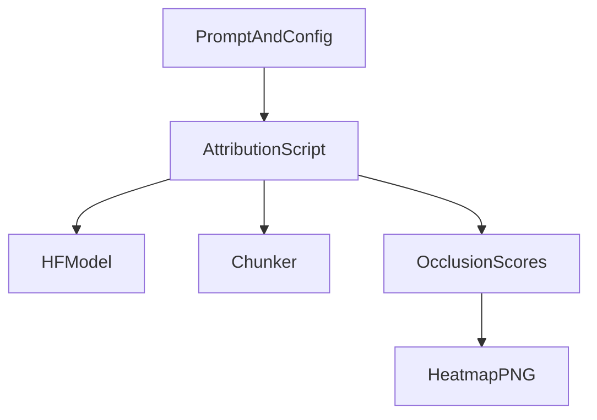

# Python Image MVP

## Goal
Ship a single Python script that takes a prompt, computes chunk-occlusion importance using an open-weights model, and writes a PNG heatmap to disk.

## Minimal Architecture

## Key Files
- Add `scripts/attribution_image.py` to run the end-to-end pipeline.
- Add `requirements.txt` (or `backend/requirements.txt` if it already exists) with minimal deps: `transformers`, `torch`, `numpy`, `matplotlib`, `sentencepiece` (if needed by model), and `tqdm` for progress.
- Optional: `data/example_prompt.txt` for a canned demo prompt.

## Implementation Steps
1. **Chunking and occlusion**: implement paragraph/sentence chunking and deletion-based occlusion in `scripts/attribution_image.py` (coarse-only for v1; no refinement).
2. **Scoring**: compute baseline score using logprob sum over the first N answer tokens (e.g., 20–30). For each occluded chunk, recompute score and take delta.
3. **Visualization**: render a heatmap over the original prompt text and save to `outputs/heatmap.png` using matplotlib; map chunk scores back to token spans or chunk spans (simple chunk-level overlay for v1).
4. **CLI config**: add minimal CLI flags for model name, prompt path, max new tokens, and output file path.

## Notes and Constraints
- Deterministic generation (`temperature=0`) to keep scores stable.
- Keep it single-file to reduce friction; no server/UI yet.

## Validation
- Run the script on `data/example_prompt.txt` and confirm `outputs/heatmap.png` exists and highlights at least one chunk with non-zero score.

## Future Iteration Hooks
- Two-stage refinement and token-level heatmap.
- Web UI or notebook integration.